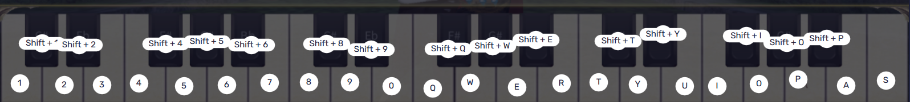
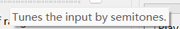

# MIFMP(MIDI Input to FFXIV Mobile Piano) for Windows
[English](#English)
## 此项目为[GreatCorn](https://github.com/GreatCorn)的[MIRP](https://github.com/GreatCorn/MIRP/)为FF14手游所做的修改版
遵循GNU GPL-3.0协议
# 注意，本软件为自动演奏脚本，使用即表示您已了解并承担可能的风险，使用后产生的任何后果开发者不负任何责任。
### 新功能
为了适配FF14手游的钢琴演奏，更改了按键的数量
增加了演奏前的三秒倒计时，避免手忙脚乱
### 如何使用
#### 1. 前往[Releases](https://github.com/Psammosignum/MIFMP/releases)页面下载文件，文件名应为MIFMPx.x.x.zip

1.1 解压，打开MIFMP.exe

#### 2. 准备一个安卓模拟器，下好FF14手游

2.1 打开游戏，登录账号

2.2 找一个地方，点开演奏，选择想要的乐器

2.3 准备一个你想演奏的音乐的MIDI(.mid)文件

2.4 在模拟器配置键盘按键对应的操作

2.5 在软件中点开文件-打开MIDI文件...，然后选择你要演奏的MIDI文件，打开

2.6 根据自己的需求调整软件设置，不知道的东西把鼠标悬停在上面会出说明

#### 3.调好以后点击播放按键▶，然后快速点击模拟器窗口，让键盘的输入能进到模拟器窗口中
#### 4.享受吧
#### 附加
MIDI放着没反应怎么办？点一下跳步按钮解决99%问题，跳步按钮在Tempo%左边
## English
## This is a modified version of [GreatCorn](https://github.com/GreatCorn)'s[MIRP](https://github.com/GreatCorn/MIRP/). Made for FFXIV Mobile
Works under GNU GPL3.0
# Caution!!! This software is a autoplay script. Use at your own risk. Developer is not responsible for anything this software cause.
### New Functions
To get work on FF14 Mobile bard music play system, modified the key number.
Added 3 seconds count down before start play.
### How to use
#### 1. Go to [Releases](https://github.com/Psammosignum/MIFMP/releases) download MIFMPx.x.x.zip

1.1 Unzip the zip file and open MIFMP.exe

#### 2. Prepare a android simulator

2.1 Login to the game

2.2 Find a place you like and start play
2.3 Prepare a MIDI(.mid) file you want to play

2.4 Bind hotkeys in simulator settings

2.5 Click on File-Open MIDI...，Find and choose your MIDI file, open it.

2.6 Change the software settings as you like. You can hover on sliders, buttons and etc. to get what will this thing do.

#### 3.Then click play▶ and click the simulator window quickly. Make computer focus on the simulator.
#### 4.Enjoy
#### Addition
What if nothing happenes when MIDI file playing? Try press jump step button once! It's on the left side of the "Tempo%"
